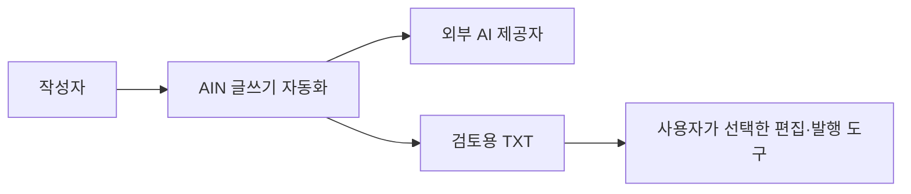

# C1 · 맥락

```mermaid
flowchart LR
  author[작성자] --> ain[AIN 글쓰기 자동화]
  ain --> ai[외부 AI 제공자]
  ain --> txt[검토용 TXT]
  txt --> destination[사용자가 선택한 편집·발행 도구]
```

- 범위: 입력·초안·수정·상태 추적·결과 인계
- 발행 시스템·소비 제품 내부 구조 인지 없음
